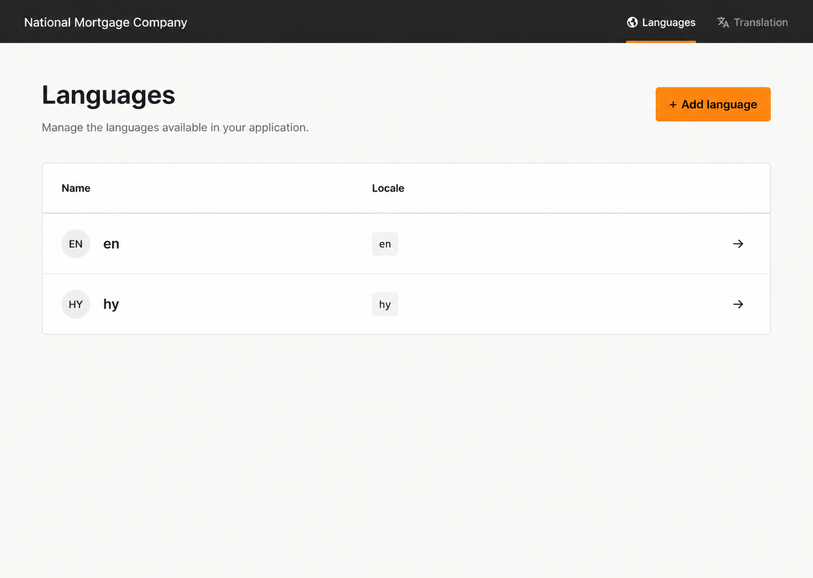

<div align="center">


# Laravel Translation

Manage Laravel file or database translations through Artisan and a web interface.




</div>

## What the package does

Laravel Translation discovers, creates, edits, and synchronizes translations while keeping the normal Laravel APIs (`__()`, `trans()`, and `@lang`) available to application code.

- Manage PHP array translations, JSON translations, and vendor namespaces.
- Store translations in Laravel language files or in a database.
- Edit translations in a responsive web manager with inline save states.
- Scan configured application paths for missing keys.
- Manage and synchronize translations through Artisan commands.

## Requirements and compatibility

Version 4 is a major release because Laravel 8/9, PHP 8.0, legacy factories, Laravel Mix, Vue, and the old frontend toolchain are no longer supported.

| Laravel | PHP | Laravel Translation |
| --- | --- | --- |
| 10 | 8.1+ | 4.x |
| 11 | 8.2+ | 4.x |
| 12 | 8.2+ | 4.x |
| 13 | 8.3+ | 4.x |

The package CI also tests Laravel 13 on PHP 8.5 with PHPUnit 13. If upgrading from 3.x, read [UPGRADE.md](UPGRADE.md) before changing the Composer constraint.

Every matrix line resolves dependencies from scratch and runs Composer's security audit. The Laravel 10/11 jobs and the intentionally lowest-dependency Laravel 13 job expose audit reports without blocking compatibility tests; the normal Laravel 12 and latest Laravel 13 jobs remain release-blocking. Applications should review the report for their resolved dependency graph and apply their own risk policy.

## Installation

Install the stable 4.x line:

```shell
composer require arm092/laravel-translation:^4.0
```

Laravel package discovery registers both service providers automatically. Publish the configuration and compiled assets:

```shell
php artisan vendor:publish --provider="JoeDixon\Translation\TranslationServiceProvider" --tag=config
php artisan vendor:publish --provider="JoeDixon\Translation\TranslationServiceProvider" --tag=assets
```

The manager is then available at `/languages` by default. Published assets keep stable URLs:

```text
/vendor/translation/css/main.css
/vendor/translation/js/app.js
```

Run the asset publish command again with `--force` after a package upgrade. Views and package language strings can also be customized by publishing everything from the provider:

```shell
php artisan vendor:publish --provider="JoeDixon\Translation\TranslationServiceProvider"
```

This copies views to `resources/views/vendor/translation` and localization strings to `lang/vendor/translation`. Publish these only when application-level customization is needed, because published copies override future package improvements.

## Configuration

The published `config/translation.php` is the public package configuration. After changing it in an environment that caches configuration, run `php artisan config:clear` during development or rebuild the production config cache.

### Driver

```php
'driver' => 'file', // file or database
```

Use `file` to edit Laravel's PHP and JSON language files directly. Use `database` when translations must be shared by multiple application servers or managed independently of a deployment artifact. The package replaces Laravel's translator loader only for the database driver; file mode keeps Laravel's native loader.

### Route middleware

```php
'route_group_config' => [
    'middleware' => ['web'],
],
```

`middleware` accepts either a string or an array. The default `web` middleware provides sessions, CSRF protection, and validation error sharing. For production, require authentication as well:

```php
'route_group_config' => [
    'middleware' => ['web', 'auth'],
],
```

Other valid Laravel route-group options, such as `domain`, may be placed in `route_group_config`. The package always appends its authorization middleware to this group.

### Authorization gate

```php
'authorization_gate' => null,
```

`null` preserves the historical behavior: anyone who passes the configured route middleware can use the manager. This is convenient for local upgrades but is not the recommended production setting.

For production, define an application-owned gate and configure its name:

```php
// app/Providers/AppServiceProvider.php
use App\Models\User;
use Illuminate\Support\Facades\Gate;

public function boot(): void
{
    Gate::define('manage-translations', function (User $user): bool {
        return $user->is_admin;
    });
}
```

```php
// config/translation.php
'route_group_config' => [
    'middleware' => ['web', 'auth'],
],
'authorization_gate' => 'manage-translations',
```

The manager calls `Gate::authorize('manage-translations')` for every web request. Laravel returns HTTP 403 when the gate denies access. The gate does not run for Artisan commands, so command execution must be protected with normal deployment and server permissions.

Why both `auth` and a gate? `auth` establishes who the user is; the gate decides whether that authenticated user may change application translations. Using only `auth` would grant access to every signed-in user.

### Scanner

```php
'translation_methods' => ['trans', '__'],
'scan_paths' => [app_path(), resource_path()],
```

`translation_methods` lists function names whose string arguments are treated as translation keys. `scan_paths` limits where source scanning occurs. Keep these paths as narrow as practical to reduce scan time and avoid interpreting unrelated files.

### Manager URL

```php
'ui_url' => 'languages',
```

This value is the route prefix, not a complete URL. With the default, the language list is `/languages` and an English translation page is `/languages/en/translations`. The inline-save endpoint is generated with Laravel's named `route()` helper, so domains, base paths, and URL generation settings remain consistent.

### Database settings

```php
'database' => [
    'connection' => '',
    'languages_table' => 'languages',
    'translations_table' => 'translations',
],
```

An empty `connection` uses Laravel's default database connection. Supply a configured connection name to isolate translation data. The table values allow existing naming conventions or shared schemas. These settings affect the models and package migrations, so configure them before migrating.

## Drivers

### File driver

File mode is the default and supports:

- locales such as `en`, `en_US`, and `pt-BR`;
- PHP group files such as `lang/en/validation.php`;
- JSON files such as `lang/en.json`;
- vendor groups such as `package::messages`;
- dotted translation keys.

Locale, namespace, and group identifiers are validated before filesystem access. Directory separators and traversal segments are rejected. The PHP process must have write permission for the application's language directory if translations will be changed through the manager or Artisan.

### Database driver

Set the driver, configure the connection/table names, then run the migrations:

```php
'driver' => 'database',
```

```shell
php artisan migrate
php artisan translation:sync-translations
```

The synchronization command imports existing file translations after prompting for source and destination drivers. When database mode is active, the package registers its database-backed loader so existing Laravel translation calls need no code changes.

Writes are language-scoped and invalidate the package's in-memory group cache. Legacy rows with a null group are upgraded to the `single` group only for their own language.

## Web manager

Open the configured manager URL and select a language. Click the pencil icon or translation text, edit the value, and move focus away from the field to save. The inline editor exposes four states: unchanged, loading, saved, and error. Requests use the Fetch API, include Laravel's CSRF token, and use same-origin credentials.

Validation and session messages are escaped before rendering. Requests reject invalid locale, namespace, group, and key input. These checks are defense in depth; the manager should still be protected with `web`, `auth`, and an application-defined gate.

## Artisan commands

| Command | Purpose |
| --- | --- |
| `translation:add-language` | Add a locale to the active driver. |
| `translation:add-translation-key` | Add a translation key and value. |
| `translation:list-languages` | List locales available to the active driver. |
| `translation:list-missing-translation-keys` | Scan and display keys missing from translations. |
| `translation:sync-translations` | Synchronize translations between file and database drivers. |
| `translation:sync-missing-translation-keys` | Create scanner-discovered missing keys for one or all languages. |

The authorization gate protects only web-manager routes and intentionally does not affect these commands.

## Frontend and Apricode palette

Version 4 uses Blade, Alpine.js 3, vanilla Fetch, Tailwind CSS 4, and Vite 8. Vue, Axios, Laravel Mix, and the old PostCSS/Tailwind chain were removed. Livewire is not required.

Only these semantic colors are defined in the package source:

| Token | Value | Use |
| --- | --- | --- |
| `primary` | `#FD971F` | Links, active elements, and primary actions |
| `success` | `#A6E22E` | Successful saves and confirmations |
| `error` | `#F92672` | Errors and destructive indicators |
| `info` | `#66D9EF` | Informational states and focus rings |
| `graphite` | `#272822` | Navigation, borders, and secondary text |
| `ink` | `#060606` | Main text and text on bright status colors |
| `paper` | `#F8F8F2` | Page background and navigation text |
| `white` | `#FFFFFF` | Panels and form fields |

Muted, hover, and border variants are derived with opacity or `color-mix()`; no additional hardcoded palette colors are introduced.

Consumers normally publish the prebuilt assets. To develop the package frontend itself, use Node `^20.19` or `>=22.12`:

```shell
npm ci
npm test
npm run check:palette
npm run build
```

The build writes the stable public filenames under `public/assets`, which the service provider publishes to `public/vendor/translation` in the host application.

## Upgrading and troubleshooting

See [UPGRADE.md](UPGRADE.md) for the complete 3.x to 4.x checklist and [CHANGELOG.md](CHANGELOG.md) for release changes.

- **403 from the manager:** confirm the user is authenticated and the configured gate exists and returns `true`.
- **Old styling or JavaScript:** republish assets with `--force`, clear Laravel caches, and invalidate any CDN/browser cache.
- **Configuration changes ignored:** rebuild Laravel's cached configuration.
- **File writes fail:** verify write access to `langPath()` and confirm locale/group values use supported identifiers.
- **Database translations are missing:** confirm `driver`, connection, and table names, run migrations, then synchronize translations.

## License

Laravel Translation is open-source software licensed under the [MIT license](LICENSE.md).
